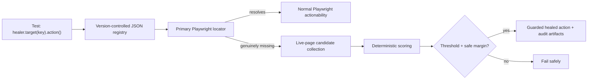

# Healwright

Healwright is a small, safety-first self-healing layer for Playwright Test. Its intended API is
explicit:

```ts
await healer.target('checkout.placeOrder').click();
```

The framework will try a version-controlled primary locator first and consider a replacement only
when the target is genuinely missing. A false-positive heal is treated as worse than a failed heal.

> **Current status:** foundation only. This stage contains the deterministic fixture app, one
> ordinary (non-healing) Playwright test, and quality tooling. No healing behavior is implemented
> yet.

## Foundation demo

Requirements: Node.js 20+ and pnpm 11.

```bash
pnpm install
pnpm exec playwright install chromium
pnpm test:baseline
```

Run all local quality gates:

```bash
pnpm format:check
pnpm lint
pnpm typecheck
pnpm test:baseline
```

The Playwright configuration starts the deterministic fixture app automatically at
`http://127.0.0.1:4173`.

## Planned architecture



Planned scoring signals are accessible role and name, stable attributes, visible text, tag,
ancestor context, nearby text/elements, and low-weight geometry. Planned modes are `off`, `observe`,
`guarded`, and `strict-ci`. The MVP will support `click`, `fill`, `check`, and `selectOption`, and
role, label, test-id, text, and CSS locator definitions.

## Safety boundaries

Healwright will not heal assertions, expected results, business logic, authentication, test-data
problems, API/network failures, or real product regressions. It will not silently rewrite test
source or the locator registry. Low-confidence and ambiguous matches will fail.

## Current limitations

- The healing wrapper, JSON registry, candidate scoring, audit history, and custom result reporting
  are not part of this foundation stage.
- The fixture currently models only the stable baseline state; controlled mutations and adversarial
  cases will be added alongside healing behavior.
- Only Chromium is configured.
