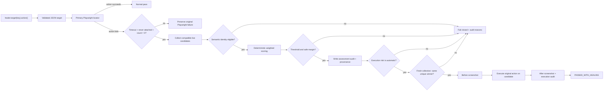

# Healwright

[](https://github.com/kamenAsenov/healwright/actions/workflows/ci.yml)

**A conservative, deterministic self-healing layer for Playwright Test.**

Healwright is an experimental TypeScript framework for UI locator drift. Tests address semantic
targets through an explicit wrapper, while target definitions, primary locators, fingerprints, and
safety policies live in version-controlled JSON.

```ts
await healer.target('checkout.placeOrder').click();
```

The design optimizes for the failure mode that matters most: **a false-positive heal is worse than a
failed heal**.

> [!IMPORTANT]
> Automatic healed actions run only in `guarded` mode, after two independent candidate collections
> agree, policy thresholds pass twice, and the winner resolves through one unique accessible
> identity. Healwright never silently changes source files or the locator registry.

## Why this project exists

Conventional UI tests fail when a locator changes, even if the user-facing control remains the same.
Naive self-healing can be more dangerous: it may click a plausible but incorrect element and turn a
real regression into a green build.

Healwright takes the narrow path:

- run the primary Playwright locator normally;
- classify drift only when the locator was never attached and still resolves to zero elements;
- preserve ordinary Playwright failures for disabled, hidden, ambiguous, delayed, or detached
  elements;
- collect only action-compatible candidates from the live page;
- score candidates with fixed, inspectable weights;
- require both a confidence threshold and a safe lead over the runner-up;
- fail closed whenever the evidence is weak or ambiguous.

## Current capabilities

| Capability                                                   | Status    |
| ------------------------------------------------------------ | --------- |
| Strict TypeScript and Chromium-first Playwright Test setup   | Available |
| JSON registry with runtime validation and JSON Schema        | Available |
| Role, label, test-id, text, and CSS primary locators         | Available |
| `click`, `fill`, `check`, and `selectOption` wrapper actions | Available |
| Conservative missing-target classification                   | Available |
| Live action-compatible candidate collection                  | Available |
| Deterministic weighted scoring and ranked details            | Available |
| Confidence threshold and runner-up margin assessment         | Available |
| `off`, `observe`, `guarded`, and `strict-ci` modes           | Available |
| Versioned JSON events, JSONL history, and report attachments | Available |
| Before/after screenshots and report attachments              | Available |
| Visible `PASSED_WITH_HEALING` result decoration              | Available |
| Guarded replacement execution with second-pass revalidation  | Available |
| Typed ESM build with explicit package exports                | Available |
| Provenance-backed, review-only locator proposals             | Available |
| Strict proposal parsing, stale-state, and tamper detection   | Available |
| Parallel-safe reporter aggregation and run summaries         | Available |
| Explicit `automatic` / `proposal-only` execution risk        | Available |
| Run budgets, expiring waivers, and baseline regression gates | Available |
| Deterministic JSON and Markdown health summaries             | Available |
| Provider-neutral governance CLI and CI artifact integration  | Available |

## Quick start

Requirements: Node.js 20+ and pnpm 11.

```bash
pnpm install
pnpm exec playwright install chromium
pnpm test
```

Run the quality gates independently:

```bash
pnpm format:check
pnpm lint
pnpm typecheck
pnpm build
pnpm package:check
pnpm test:reporter:parallel
pnpm test
pnpm evidence:verify
pnpm governance:evaluate
```

Playwright starts the deterministic fixture app automatically at `http://127.0.0.1:4173`.

## Package contract

The package remains marked private and unpublished. `pnpm build` emits ESM, source maps,
declarations, and declaration maps to the ignored `dist/` directory. The package exposes seven intentional
entry points:

- `healwright` for the public framework API;
- `healwright/reporter` for the Playwright reporter;
- `healwright/registry-schema` for the target-registry JSON Schema;
- `healwright/proposal-schema` for the review-proposal JSON Schema;
- `healwright/evidence-summary-schema` for the run-summary JSON Schema.
- `healwright/governance-policy-schema` for governance configuration;
- `healwright/health-summary-schema` for machine-readable policy results.

`pnpm package:check` compiles an external-style TypeScript consumer, self-imports both JavaScript
entry points through Node's package resolution, verifies the expected artifacts, and exercises the
evidence and proposal CLIs—including deliberate mismatch and tampering failures. `pnpm pack
--dry-run --json` additionally shows the exact files that would enter a tarball without creating or
publishing one.

## Wrapper API

```ts
import {
  FileScreenshotCapture,
  PlaywrightHealingResultSink,
  createPlaywrightAuditProvenance,
  createHealer,
  loadTargetRegistry,
} from 'healwright';

const registry = await loadTargetRegistry(new URL('./registry/targets.json', import.meta.url));
const runId = process.env.GITHUB_RUN_ID ?? process.env.HEALWRIGHT_RUN_ID;
const healer = createHealer({
  page,
  registry,
  mode: 'guarded',
  primaryActionTimeoutMs: 2_000,
  screenshotCapture: new FileScreenshotCapture(page, testInfo.outputPath('healwright-screenshots')),
  resultSink: new PlaywrightHealingResultSink(testInfo),
  ...(runId === undefined
    ? {}
    : {
        auditProvenance: createPlaywrightAuditProvenance(testInfo, {
          runId,
          ...(process.env.GITHUB_SHA === undefined ? {} : { commitSha: process.env.GITHUB_SHA }),
        }),
      }),
});

await healer.target('checkout.cardholderName').fill('Ada Lovelace');
await healer.target('checkout.shippingCountry').selectOption('GB');
await healer.target('checkout.terms').check();
await healer.target('checkout.placeOrder').click();
```

Every action checks the target's allowlist before resolving its primary locator. Assertions are not
part of the wrapper and are never eligible for healing.

## Runtime modes

| Mode        | Missing-locator behavior                                                                             |
| ----------- | ---------------------------------------------------------------------------------------------------- |
| `off`       | Runs only the primary Playwright action; no classification, collection, or audit event               |
| `observe`   | Classifies, ranks, and audits candidates, then preserves the missing-primary failure                 |
| `guarded`   | Executes only after the candidate passes policy twice and resolves to one unique accessible identity |
| `strict-ci` | Ranks for diagnostics but always records a strict CI failure decision                                |

`guarded` is the default. A first-pass `eligible` decision is necessary but never sufficient to
execute: Healwright recollects and reranks the live page, requires the same winner and safe margin,
then resolves that candidate through an exact accessible role, name, and tag. A candidate test-id is
also included when one exists. The resulting locator must match exactly one element.

## Target registry

Targets are human-reviewable and version controlled in [`registry/targets.json`](registry/targets.json).
The companion [`registry/targets.schema.json`](registry/targets.schema.json) provides editor support,
while the runtime loader rejects unknown fields, invalid roles, unsupported actions, duplicate
actions, malformed fingerprints, and unsafe policy values.

```json
{
  "checkout.placeOrder": {
    "description": "Final checkout submission button",
    "primary": {
      "type": "role",
      "role": "button",
      "name": "Place order",
      "exact": true
    },
    "fingerprint": {
      "accessibleRole": "button",
      "accessibleName": "Place order",
      "visibleText": "Place order",
      "tag": "button",
      "ancestorText": ["Checkout"]
    },
    "policy": {
      "allowedActions": ["click"],
      "executionRisk": "proposal-only",
      "healing": {
        "enabled": true,
        "confidenceThreshold": 0.95,
        "minimumScoreMargin": 0.2
      }
    }
  }
}
```

Registry policy values are validated and enforced during both assessment passes. `automatic` permits
guarded execution after every locator safety gate passes. `proposal-only` still collects and ranks
evidence but can never execute a replacement. Risk is explicit per target: both
`checkout.applyDiscount` and `checkout.placeOrder` use `click`, while only the latter is protected.
Older v0.3 registries without `executionRisk` retain `automatic` behavior; v0.4 registries should
declare every target explicitly. See the [v0.4 migration guide](docs/MIGRATION-v0.4.md).

## Safety pipeline



### Missing means genuinely missing

A failed primary action becomes `MissingPrimaryLocatorError` only when all three checks agree:

1. the normal Playwright action ended with a public `TimeoutError`;
2. a concurrent public `locator.waitFor({ state: 'attached' })` never observed the target;
3. a post-failure public `locator.count()` still returns zero.

If the target was ever attached—or the failure is strictness, actionability, navigation, page
closure, or another non-timeout error—Healwright preserves the original result.

## Deterministic scoring

The scoring engine is pure: identical fingerprints and candidate snapshots always produce the same
ranking. Equal scores are ordered by a stable candidate identifier. Text normalization is
locale-independent and Unicode-aware: it preserves letters and numbers across scripts, folds
diacritics deterministically, and assigns zero similarity to empty or punctuation-only values.

| Signal            | Weight | Notes                                   |
| ----------------- | -----: | --------------------------------------- |
| Accessible name   |    24% | Token and edit similarity               |
| Accessible role   |    22% | Exact normalized match                  |
| Stable attributes |    20% | Per-attribute similarity                |
| Visible text      |    12% | Token and edit similarity               |
| Ancestor context  |     7% | Best match for expected context         |
| Neighbor context  |     6% | Best match for expected nearby text     |
| Element tag       |     6% | Exact normalized match                  |
| Geometry          |     3% | Low-weight normalized position and size |

Only signals present in the stored fingerprint participate in normalization. Geometry is
intentionally too weak to overcome a semantic mismatch.

```ts
import { assessCandidates, collectCandidates, rankCandidates } from 'healwright';

const definition = registry.targets['checkout.placeOrder'];
const candidates = await collectCandidates(page, 'click');
const ranked = rankCandidates(definition.fingerprint, candidates, 'click');
const assessment = assessCandidates(ranked, definition.policy.healing);

console.log(assessment.reason, assessment.margin, ranked[0]?.details);
```

Weighted signals determine ranking, but they can never compensate for mandatory execution
eligibility. A candidate is semantically ineligible when its required accessible identity is
missing, its known role or registered tag contradicts the fingerprint, or its element identity is
incompatible with the requested action. Stable reasons are recorded on the ranked candidate and in
the assessment.

Possible assessment reasons are `eligible`, `disabled`, `no-candidates`, `semantic-ineligible`,
`low-confidence`, and `ambiguous`. `eligible` means the first evidence pass cleared semantic,
confidence, and margin gates; execution still requires the same result from the immediate second
pass and a unique accessible locator. `observe` mode retains the ranking and semantic rejection
reasons without executing anything.

## Audit events and history

Every assessed drift produces a versioned `locator-drift-assessed` JSON event before guarded
execution can begin. A guarded decision then produces `locator-heal-execution` with `succeeded`,
`failed`, or `rejected`, a reason, its parent assessment ID, and screenshot references. Events
include the mode, semantic target, action, execution risk, retry-stable operation index, sanitized
failure category, collection status, threshold
and margin decision, and ranked per-signal candidate details. Optional versioned provenance records
the run, Playwright test ID, project, retry index, and commit SHA. Action values such as filled text
are never serialized, raw error messages are omitted, absolute screenshot paths are not audited,
and collected URL attributes are reduced to paths. Text-like form controls are masked in screenshots
by default so filled values do not become visual artifacts.

The default sink appends JSONL history to:

```text
test-results/healwright/history.jsonl
```

Sinks are composable. A test can keep JSONL history and attach the same structured event to the
Playwright report through the public [`testInfo.attach()` API](https://playwright.dev/docs/api/class-testinfo#test-info-attach):

```ts
import {
  CompositeAuditSink,
  JsonlAuditSink,
  PlaywrightAttachmentAuditSink,
  createPlaywrightAuditProvenance,
  createHealer,
} from 'healwright';

const auditSink = new CompositeAuditSink([
  new JsonlAuditSink(testInfo.outputPath('healwright-history.jsonl')),
  new PlaywrightAttachmentAuditSink(testInfo),
]);

const healer = createHealer({
  page,
  registry,
  mode: 'observe',
  auditSink,
  auditProvenance: createPlaywrightAuditProvenance(testInfo, {
    runId: process.env.GITHUB_RUN_ID ?? process.env.HEALWRIGHT_RUN_ID ?? testInfo.testId,
  }),
});
```

For proposal-quality evidence, set one run ID for the entire suite and reuse it across retries. In
GitHub Actions, `GITHUB_RUN_ID` provides that identity. Locally, start each independent run with a
new value, for example `HEALWRIGHT_RUN_ID="$(uuidgen)" pnpm test:healing`. Falling back to
`testInfo.testId` is safe for ordinary auditing, but repeated executions will intentionally not
count as independent proposal evidence.

For parallel runs, prefer `PlaywrightAttachmentAuditSink`. The Healwright reporter receives those
typed attachments in Playwright's coordinator process and atomically writes deterministic output:

```text
test-results/healwright/history.jsonl
test-results/healwright/summary.json
```

The summary includes assessment decisions, execution outcomes, target/action counts, successful
heals, runs, tests, projects, retries, commits, and legacy-event counts. Identical duplicate events
are deduplicated; conflicting reuse of an event ID, a malformed typed attachment, a missing body, or
an attachment/event-ID mismatch fails closed. Verify the pair independently with:

```bash
pnpm evidence:verify
```

This reporter-level path avoids concurrent workers writing one shared file and remains compatible
with Playwright's supported custom-reporter and merged-report workflows. Direct `JsonlAuditSink`
instances remain useful for isolated processes and per-test files. If a default JSONL history is
already present, the reporter validates and merges it with attached events; malformed history or a
conflicting event ID fails the run instead of being overwritten.

## Governance and healing budgets

Governance is a post-run consumer of canonical evidence. It cannot make an ineligible locator
eligible and is deliberately separate from the runtime healer. The checked-in
[`governance/policy.json`](governance/policy.json) demonstrates run, target, target/action, unknown
identity, and baseline limits:

```json
{
  "version": 1,
  "failOnUnknownTargets": true,
  "limits": {
    "maxSuccessfulHealsPerRun": 10,
    "maxRejectedAttemptsPerRun": 10,
    "targets": {
      "checkout.placeOrder": {
        "maxSuccessfulHeals": 0,
        "actions": { "click": { "maxSuccessfulHeals": 0 } }
      }
    }
  },
  "baseline": { "successfulHeals": 10, "rejectedAttempts": 10 }
}
```

Evaluate the canonical reporter output locally or in any CI system:

```bash
pnpm governance:evaluate -- \
  --history test-results/healwright/history.jsonl \
  --registry registry/targets.json \
  --policy governance/policy.json \
  --json test-results/healwright/health-summary.json \
  --markdown test-results/healwright/health-summary.md
```

The CLI returns `0` for a pass, `1` for policy violations, and `2` for malformed, conflicting,
non-canonical, or unreadable inputs. `--no-policy` produces a backward-compatible health summary
without optional budgets. It reads no provider-specific environment variables.

Health output is deterministically ordered by target, action, project, and outcome. It reports
successful, rejected, protected, failed, observed, waived, and discarded-retry counts without raw
page content or error messages. GitHub Actions is only one consumer: CI runs the same CLI and uploads
the JSON, Markdown, canonical evidence, and policy as ordinary artifacts.

Temporary waivers require an exact target, optional exact action, non-empty reason, and future UTC
expiry. Wildcards, duplicates, overlaps, malformed dates, and expired waivers fail closed. An active
waiver changes only budget accounting; it cannot override drift proof, action allowlists, target
risk, semantic eligibility, confidence, margin, uniqueness, second-pass agreement, or evidence
validation. The full configuration contract is in the [policy reference](docs/POLICY.md). Small
executable examples live in [`examples/governance`](examples/governance).

An audit-write failure is surfaced as `AuditWriteError`; Healwright will not continue toward a
healed action without its required evidence trail. A pre-action screenshot failure also prevents
execution. If the replacement itself has an actionability problem, its ordinary Playwright failure
is preserved and no passing marker is emitted.

## Reviewable locator proposals

Successful healing is evidence, not permission to edit code. Healwright can aggregate local JSONL
history into a versioned JSON proposal bundle and a readable Markdown report:

```bash
pnpm proposal:generate -- \
  --history test-results/healwright/history.jsonl \
  --registry registry/targets.json \
  --json test-results/healwright/proposals.json \
  --markdown test-results/healwright/proposals.md
```

The command defaults to those paths and requires three distinct provenance run IDs for the same
target, action, and exact accessible role/name identity. Retried tests and repeated actions from one
run cannot inflate confidence. Each chain must connect an eligible assessment to its successful
guarded execution with identical provenance. Legacy events remain readable but do not count toward
consensus. Reused events, orphaned executions, mixed or partially recorded commits, unsupported
roles, missing screenshot phases, disabled or changed policies, no-longer-allowed actions, stale
primary locators, and conflicting candidates all fail closed.

Every proposal contains:

- the current primary locator and a suggested exact role locator;
- minimum and maximum observed scores plus the minimum runner-up margin;
- distinct run, test, project, retry, and optional commit provenance;
- assessment, execution, candidate, and screenshot references;
- a target-definition digest that makes later fingerprint or policy changes stale;
- a deterministic SHA-256 proposal ID covering all review-sensitive content;
- an explicit `review-required` status.

The generator verifies each proposal against the current registry immediately before writing. The
public `parseHealingProposalBundle()` and `verifyHealingProposalBundle()` APIs strictly reject
malformed, extended, tampered, stale, and unknown-target bundles. The same checks are available as a
separate quality gate:

```bash
pnpm proposal:verify -- \
  --proposal test-results/healwright/proposals.json \
  --registry registry/targets.json
```

Both proposal commands are read-only with respect to the registry and test source. Output paths are
also prevented from overwriting the input history or registry.

> [!CAUTION]
> Proposal generation never changes `registry/targets.json`, test source, or application code. A
> human must inspect the evidence and make any registry change as a normal reviewed code edit.

## Visible healed results

The default console result sink prints `PASSED_WITH_HEALING`. For richer evidence,
`PlaywrightHealingResultSink` adds a structured marker and both screenshots to the Playwright test
result. The included reporter prints an unmistakable line for each successful heal:

```text
PASSED_WITH_HEALING chromium › healing.browser.spec.ts › heals compatible checkbox locator drift · checkout.terms check
```

The reporter is enabled locally in `playwright.config.ts`. Consumer configuration uses the exported
reporter subpath:

```ts
export default defineConfig({
  reporter: [['line'], ['healwright/reporter'], ['html', { open: 'never' }]],
});
```

Run the focused demo with:

```bash
pnpm test:healing
pnpm exec playwright show-report
```

## Deterministic fixture and tests

The local checkout fixture supports controlled query-string mutations:

| Mutation                   | Purpose                                                       |
| -------------------------- | ------------------------------------------------------------- |
| `missing-place-order`      | Genuine primary-locator absence                               |
| `delayed-place-order`      | Normal Playwright waiting                                     |
| `disabled-place-order`     | Actionability failure                                         |
| `duplicate-place-order`    | Strict-locator ambiguity                                      |
| `detached-place-order`     | Target observed, then removed                                 |
| `drifted-terms`            | Genuine test-id drift with a semantically identical candidate |
| `drifted-cardholder`       | Exact-label case drift for `fill`                             |
| `drifted-country`          | CSS id drift for `selectOption`                               |
| `drifted-discount`         | Exact-text case drift for `click`                             |
| `drifted-place-order`      | Protected final-action accessible-name drift                  |
| `ambiguous-drifted-terms`  | Two indistinguishable checkbox candidates                     |
| `drifted-disabled-terms`   | Compatible but non-actionable replacement                     |
| `drifted-wrong-role-terms` | Same control data with a contradictory accessible role        |

The suite contains baseline, registry-validation, wrapper, classification, adversarial mutation,
candidate-collection, scoring, audit-provenance, and proposal-integrity tests. Ajv verifies that the
checked-in JSON Schema and strict runtime parser agree on safety-sensitive boundaries. Fast-check
exercises scoring and policy invariants with the fixed seed `20260815`, making every failure
reproducible. GitHub Actions installs Chromium, runs every static gate and test, and uploads the
Playwright HTML report.

An additional 50-test contract layer covers the less obvious failure surfaces that matter for safe
healing:

| Contract area            | Coverage                                                                  |
| ------------------------ | ------------------------------------------------------------------------- |
| Locator resolution       | Exact/partial semantics, all five locator types, live DOM re-resolution   |
| Registry validation      | Malformed roots, versions, extra data, roles, geometry, and action policy |
| Scoring boundaries       | Normalization, absent signals, context, geometry, reweighting, thresholds |
| Candidate collection     | Visibility, bounded data, attribute privacy, action compatibility         |
| Runtime safety and audit | Drift proof, fail-closed sinks, artifact naming/masking, result metadata  |

Useful focused commands:

```bash
pnpm test:registry
pnpm test:registry:parity
pnpm test:classification
pnpm test:expanded
pnpm test:audit
pnpm test:modes
pnpm test:modes:browser
pnpm test:healing
pnpm test:healing:adversarial
pnpm test:missing
pnpm test:candidates
pnpm test:scoring
pnpm test:scoring:property
pnpm test:primary
pnpm test:proposals
pnpm test:governance
pnpm governance:evaluate
```

## Project structure

```text
.
├── fixtures/app/               # Deterministic checkout UI and controlled mutations
├── governance/                 # Checked-in run policy
├── examples/governance/        # Minimal and intentionally failing policies
├── docs/                       # Policy reference and migration guidance
├── CHANGELOG.md                # Versioned release notes and security-relevant changes
├── package-tests/              # External-consumer TypeScript contract
├── playwright.unit.config.ts   # Fast browser-free policy and scoring tests
├── registry/                   # Target, evidence, proposal, policy, and health JSON Schemas
├── scripts/
│   ├── propose-heals.mjs       # Local review-artifact generator
│   ├── evaluate-governance.mjs # Provider-neutral budget and health gate
│   ├── verify-evidence.mjs     # Canonical history and summary consistency gate
│   └── verify-proposals.mjs    # Proposal integrity and registry-state gate
├── src/
│   ├── artifacts.ts            # Before/after screenshot capture
│   ├── candidates.ts           # Public-API live candidate snapshots
│   ├── audit.ts                # Versioned events and local/Playwright sinks
│   ├── classification.ts       # Conservative missing-target proof
│   ├── evidence.ts             # Canonical aggregation, summaries, and atomic output
│   ├── healer.ts               # Explicit wrapper API
│   ├── governance.ts           # Policies, waivers, evaluation, and health summaries
│   ├── locator.ts              # Primary locator resolution
│   ├── proposal-validation.ts  # Strict proposal parser and bundle verification
│   ├── proposals.ts            # Consensus, integrity checks, and Markdown reports
│   ├── reporter.ts             # Visible PASSED_WITH_HEALING output
│   ├── result.ts               # Playwright annotations and attachments
│   ├── registry.ts             # Strict runtime registry validation
│   ├── scoring.ts              # Pure weighted ranking and assessment
│   └── types.ts                # Registry and policy types
├── tests/                      # Unit, integration, and adversarial Playwright tests
├── tsconfig.build.json         # ESM and declaration build
├── tsconfig.package-test.json  # Built-package consumer type-check
└── .github/workflows/ci.yml    # Chromium-first quality pipeline
```

## Non-negotiable safety boundaries

Healwright will not heal:

- assertions or expected results;
- business logic or real product regressions;
- authentication or authorization failures;
- test-data setup problems;
- API, network, or backend failures;
- ambiguous or low-confidence matches.
- candidates with missing or contradictory semantic identity.

It will not silently rewrite test source or the locator registry. The MVP requires no LLM, API key,
cloud service, Docker container, database, OCR, or visual AI.

## Completed foundation

- [x] Strict Playwright Test + TypeScript foundation
- [x] Version-controlled semantic target registry
- [x] Primary-only wrapper actions
- [x] Conservative missing-target classification
- [x] Live candidate collection
- [x] Deterministic scoring, ranking, threshold, and margin assessment
- [x] Modes: `off`, `observe`, `guarded`, and `strict-ci`
- [x] Versioned JSON audit events and JSONL history
- [x] Playwright JSON attachment sink
- [x] Guarded candidate execution for all four actions
- [x] Screenshot artifacts for healed attempts
- [x] Visible `PASSED_WITH_HEALING` reporting
- [x] Positive healing and expanded adversarial negative suites
- [x] JSON Schema/runtime-validator parity tests with Ajv
- [x] Seeded property-based scoring invariants
- [x] Typed ESM distribution build and package export verification
- [x] Review-only locator proposal workflow with stale/tamper detection
- [x] Versioned audit provenance and independent-run consensus
- [x] Strict proposal-bundle verification API and CLI quality gate
- [x] Parallel-safe reporter aggregation and canonical evidence summaries
- [x] Unicode-safe scoring and mandatory semantic execution gates
- [x] Explicit target execution risk with proposal-only protection
- [x] Provider-neutral budgets, baselines, strict temporary waivers, and health summaries

The staged plan from reliable evidence through policy governance, cross-browser qualification,
stronger integrity, and a stable `v1.0` contract is maintained in [`ROADMAP.md`](ROADMAP.md).

## Limitations

- Chromium is the only configured browser.
- The package is intentionally private and has not been published to a registry.
- Candidate collection currently targets common interactive HTML and ARIA patterns.
- Accessible identity is read from Playwright's public ARIA snapshot representation.
- Fingerprints and registry changes remain manual; proposals intentionally have no auto-apply path.
- Proposal consensus requires explicitly configured run provenance; legacy history is readable but
  intentionally excluded from confidence counts.
- Evidence created before `v0.3.1` remains readable but is excluded from locator proposals when it
  lacks explicit semantic-eligibility proof.
- v0.3 evidence without operation indexes uses a conservative retry fallback keyed by run, project,
  test, target, and action; repeated same-target actions in one legacy test cannot be distinguished.
- `proposal-only` evidence is observable and reviewable but never executes automatically; the
  current proposal generator still requires successful guarded execution and therefore will not
  generate a locator proposal from protected attempts alone.
- Waivers are evaluated against the configured UTC time and are intentionally budget-only; teams
  remain responsible for reviewing reasons and removing expired entries.
- Commit SHA provenance is optional, but a proposal fails closed if qualifying runs mix commits or
  only some of them record a commit.
- Proposal hashes detect changes after generation but do not authenticate the local JSONL history;
  teams must protect and review their evidence source.
- Guarded execution requires an exact, unique accessible role/name/tag identity; candidates without
  one fail closed even if their weighted score is otherwise high.
- Reporter aggregation is local to one Playwright or merged-report process; cross-machine retention
  and long-term history storage remain the responsibility of CI artifacts or the consuming team.
