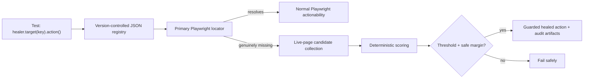

# Healwright

Healwright is a small, safety-first self-healing layer for Playwright Test. Its intended API is
explicit:

```ts
await healer.target('checkout.placeOrder').click();
```

The framework will try a version-controlled primary locator first and consider a replacement only
when the target is genuinely missing. A false-positive heal is treated as worse than a failed heal.

> **Current status:** conservative missing-target classification. The deterministic fixture can be
> driven through the explicit target API, backed by a runtime-validated JSON registry. Genuine
> absence is distinguished from actionability and waiting failures, but no healing behavior is
> implemented yet.

## Foundation demo

Requirements: Node.js 20+ and pnpm 11.

```bash
pnpm install
pnpm exec playwright install chromium
pnpm test:baseline
```

Primary-locator wrapper example:

```ts
const registry = await loadTargetRegistry(new URL('./registry/targets.json', import.meta.url));
const healer = createHealer({ page, registry });

await healer.target('checkout.cardholderName').fill('Ada Lovelace');
await healer.target('checkout.shippingCountry').selectOption('GB');
await healer.target('checkout.terms').check();
await healer.target('checkout.placeOrder').click();
```

The registry supports role, label, test-id, text, and CSS primary locators. Every target also stores
its semantic description, fingerprint, allowed actions, confidence threshold, and minimum score
margin. Those healing fields are validated but intentionally unused in this stage.

Primary actions use a two-second classification timeout by default, configurable through
`primaryActionTimeoutMs` or an individual action's Playwright `timeout` option. Healwright reports a
`MissingPrimaryLocatorError` only when the action times out, the locator was never observed attached
during that attempt, and the locator still resolves to zero elements afterward. If the locator was
disabled, hidden, ambiguous, temporarily delayed, or detached after being observed, the original
Playwright result is preserved.

Run all local quality gates:

```bash
pnpm format:check
pnpm lint
pnpm typecheck
pnpm test
```

The Playwright configuration starts the deterministic fixture app automatically at
`http://127.0.0.1:4173`.

## Planned architecture



Planned scoring signals are accessible role and name, stable attributes, visible text, tag,
ancestor context, nearby text/elements, and low-weight geometry. Planned modes are `off`, `observe`,
`guarded`, and `strict-ci`. The MVP will support `click`, `fill`, `check`, and `selectOption`, and
role, label, test-id, text, and CSS locator definitions.

## Safety boundaries

Healwright will not heal assertions, expected results, business logic, authentication, test-data
problems, API/network failures, or real product regressions. It will not silently rewrite test
source or the locator registry. Low-confidence and ambiguous matches will fail.

## Current limitations

- Candidate collection, scoring, audit history, healing modes, and custom result reporting are not
  implemented yet.
- Healing policy values are stored and validated but are not executed; only primary locators run.
- The fixture currently includes missing, delayed, disabled, duplicated, and detached target
  mutations; candidate-similarity mutations will be added alongside scoring.
- Only Chromium is configured.
