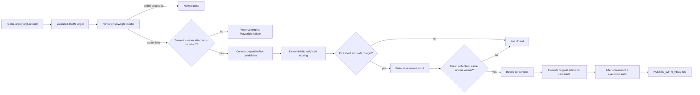

# Healwright

[](https://github.com/kamenAsenov/healwright/actions/workflows/ci.yml)

**A conservative, deterministic self-healing layer for Playwright Test.**

Healwright is an experimental TypeScript framework for UI locator drift. Tests address semantic
targets through an explicit wrapper, while target definitions, primary locators, fingerprints, and
safety policies live in version-controlled JSON.

```ts
await healer.target('checkout.placeOrder').click();
```

The design optimizes for the failure mode that matters most: **a false-positive heal is worse than a
failed heal**.

> [!IMPORTANT]
> Automatic healed actions run only in `guarded` mode, after two independent candidate collections
> agree, policy thresholds pass twice, and the winner resolves through one unique accessible
> identity. Healwright never silently changes source files or the locator registry.

## Why this project exists

Conventional UI tests fail when a locator changes, even if the user-facing control remains the same.
Naive self-healing can be more dangerous: it may click a plausible but incorrect element and turn a
real regression into a green build.

Healwright takes the narrow path:

- run the primary Playwright locator normally;
- classify drift only when the locator was never attached and still resolves to zero elements;
- preserve ordinary Playwright failures for disabled, hidden, ambiguous, delayed, or detached
  elements;
- collect only action-compatible candidates from the live page;
- score candidates with fixed, inspectable weights;
- require both a confidence threshold and a safe lead over the runner-up;
- fail closed whenever the evidence is weak or ambiguous.

## Current capabilities

| Capability                                                   | Status    |
| ------------------------------------------------------------ | --------- |
| Strict TypeScript and Chromium-first Playwright Test setup   | Available |
| JSON registry with runtime validation and JSON Schema        | Available |
| Role, label, test-id, text, and CSS primary locators         | Available |
| `click`, `fill`, `check`, and `selectOption` wrapper actions | Available |
| Conservative missing-target classification                   | Available |
| Live action-compatible candidate collection                  | Available |
| Deterministic weighted scoring and ranked details            | Available |
| Confidence threshold and runner-up margin assessment         | Available |
| `off`, `observe`, `guarded`, and `strict-ci` modes           | Available |
| Versioned JSON events, JSONL history, and report attachments | Available |
| Before/after screenshots and report attachments              | Available |
| Visible `PASSED_WITH_HEALING` result decoration              | Available |
| Guarded replacement execution with second-pass revalidation  | Available |

## Quick start

Requirements: Node.js 20+ and pnpm 11.

```bash
pnpm install
pnpm exec playwright install chromium
pnpm test
```

Run the quality gates independently:

```bash
pnpm format:check
pnpm lint
pnpm typecheck
pnpm test
```

Playwright starts the deterministic fixture app automatically at `http://127.0.0.1:4173`.

## Wrapper API

```ts
import {
  FileScreenshotCapture,
  PlaywrightHealingResultSink,
  createHealer,
  loadTargetRegistry,
} from './src/index.js';

const registry = await loadTargetRegistry(new URL('./registry/targets.json', import.meta.url));
const healer = createHealer({
  page,
  registry,
  mode: 'guarded',
  primaryActionTimeoutMs: 2_000,
  screenshotCapture: new FileScreenshotCapture(page, testInfo.outputPath('healwright-screenshots')),
  resultSink: new PlaywrightHealingResultSink(testInfo),
});

await healer.target('checkout.cardholderName').fill('Ada Lovelace');
await healer.target('checkout.shippingCountry').selectOption('GB');
await healer.target('checkout.terms').check();
await healer.target('checkout.placeOrder').click();
```

Every action checks the target's allowlist before resolving its primary locator. Assertions are not
part of the wrapper and are never eligible for healing.

## Runtime modes

| Mode        | Missing-locator behavior                                                                             |
| ----------- | ---------------------------------------------------------------------------------------------------- |
| `off`       | Runs only the primary Playwright action; no classification, collection, or audit event               |
| `observe`   | Classifies, ranks, and audits candidates, then preserves the missing-primary failure                 |
| `guarded`   | Executes only after the candidate passes policy twice and resolves to one unique accessible identity |
| `strict-ci` | Ranks for diagnostics but always records a strict CI failure decision                                |

`guarded` is the default. A first-pass `eligible` decision is necessary but never sufficient to
execute: Healwright recollects and reranks the live page, requires the same winner and safe margin,
then resolves that candidate through an exact accessible role, name, and tag. A candidate test-id is
also included when one exists. The resulting locator must match exactly one element.

## Target registry

Targets are human-reviewable and version controlled in [`registry/targets.json`](registry/targets.json).
The companion [`registry/targets.schema.json`](registry/targets.schema.json) provides editor support,
while the runtime loader rejects unknown fields, invalid roles, unsupported actions, duplicate
actions, malformed fingerprints, and unsafe policy values.

```json
{
  "checkout.placeOrder": {
    "description": "Final checkout submission button",
    "primary": {
      "type": "role",
      "role": "button",
      "name": "Place order",
      "exact": true
    },
    "fingerprint": {
      "accessibleRole": "button",
      "accessibleName": "Place order",
      "visibleText": "Place order",
      "tag": "button",
      "ancestorText": ["Checkout"]
    },
    "policy": {
      "allowedActions": ["click"],
      "healing": {
        "enabled": true,
        "confidenceThreshold": 0.95,
        "minimumScoreMargin": 0.2
      }
    }
  }
}
```

Registry policy values are validated and enforced during both assessment passes.

## Safety pipeline



### Missing means genuinely missing

A failed primary action becomes `MissingPrimaryLocatorError` only when all three checks agree:

1. the normal Playwright action ended with a public `TimeoutError`;
2. a concurrent public `locator.waitFor({ state: 'attached' })` never observed the target;
3. a post-failure public `locator.count()` still returns zero.

If the target was ever attached—or the failure is strictness, actionability, navigation, page
closure, or another non-timeout error—Healwright preserves the original result.

## Deterministic scoring

The scoring engine is pure: identical fingerprints and candidate snapshots always produce the same
ranking. Equal scores are ordered by a stable candidate identifier.

| Signal            | Weight | Notes                                   |
| ----------------- | -----: | --------------------------------------- |
| Accessible name   |    24% | Token and edit similarity               |
| Accessible role   |    22% | Exact normalized match                  |
| Stable attributes |    20% | Per-attribute similarity                |
| Visible text      |    12% | Token and edit similarity               |
| Ancestor context  |     7% | Best match for expected context         |
| Neighbor context  |     6% | Best match for expected nearby text     |
| Element tag       |     6% | Exact normalized match                  |
| Geometry          |     3% | Low-weight normalized position and size |

Only signals present in the stored fingerprint participate in normalization. Geometry is
intentionally too weak to overcome a semantic mismatch.

```ts
import { assessCandidates, collectCandidates, rankCandidates } from './src/index.js';

const definition = registry.targets['checkout.placeOrder'];
const candidates = await collectCandidates(page, 'click');
const ranked = rankCandidates(definition.fingerprint, candidates);
const assessment = assessCandidates(ranked, definition.policy.healing);

console.log(assessment.reason, assessment.margin, ranked[0]?.details);
```

Possible assessment reasons are `eligible`, `disabled`, `no-candidates`, `low-confidence`, and
`ambiguous`. `eligible` means the first evidence pass cleared policy; execution still requires the
same result from the immediate second pass and a unique accessible locator.

## Audit events and history

Every assessed drift produces a versioned `locator-drift-assessed` JSON event before guarded
execution can begin. A guarded decision then produces `locator-heal-execution` with `succeeded`,
`failed`, or `rejected`, a reason, its parent assessment ID, and screenshot references. Events
include the mode, semantic target, action, sanitized failure category, collection status, threshold
and margin decision, and ranked per-signal candidate details. Action values such as filled text are
never serialized, raw error messages are omitted, absolute screenshot paths are not audited, and
collected URL attributes are reduced to paths. Text-like form controls are masked in screenshots by
default so filled values do not become visual artifacts.

The default sink appends JSONL history to:

```text
test-results/healwright/history.jsonl
```

Sinks are composable. A test can keep JSONL history and attach the same structured event to the
Playwright report through the public [`testInfo.attach()` API](https://playwright.dev/docs/api/class-testinfo#test-info-attach):

```ts
import {
  CompositeAuditSink,
  JsonlAuditSink,
  PlaywrightAttachmentAuditSink,
  createHealer,
} from './src/index.js';

const auditSink = new CompositeAuditSink([
  new JsonlAuditSink(testInfo.outputPath('healwright-history.jsonl')),
  new PlaywrightAttachmentAuditSink(testInfo),
]);

const healer = createHealer({ page, registry, mode: 'observe', auditSink });
```

An audit-write failure is surfaced as `AuditWriteError`; Healwright will not continue toward a
healed action without its required evidence trail. A pre-action screenshot failure also prevents
execution. If the replacement itself has an actionability problem, its ordinary Playwright failure
is preserved and no passing marker is emitted.

## Visible healed results

The default console result sink prints `PASSED_WITH_HEALING`. For richer evidence,
`PlaywrightHealingResultSink` adds a structured marker and both screenshots to the Playwright test
result. The included reporter prints an unmistakable line for each successful heal:

```text
PASSED_WITH_HEALING chromium › healing.browser.spec.ts › heals compatible checkbox locator drift · checkout.terms check
```

The reporter is enabled in `playwright.config.ts`. Run the focused demo with:

```bash
pnpm test:healing
pnpm exec playwright show-report
```

## Deterministic fixture and tests

The local checkout fixture supports controlled query-string mutations:

| Mutation                  | Purpose                                                       |
| ------------------------- | ------------------------------------------------------------- |
| `missing-place-order`     | Genuine primary-locator absence                               |
| `delayed-place-order`     | Normal Playwright waiting                                     |
| `disabled-place-order`    | Actionability failure                                         |
| `duplicate-place-order`   | Strict-locator ambiguity                                      |
| `detached-place-order`    | Target observed, then removed                                 |
| `drifted-terms`           | Genuine test-id drift with a semantically identical candidate |
| `drifted-cardholder`      | Exact-label case drift for `fill`                             |
| `drifted-country`         | CSS id drift for `selectOption`                               |
| `drifted-discount`        | Exact-text case drift for `click`                             |
| `ambiguous-drifted-terms` | Two indistinguishable checkbox candidates                     |
| `drifted-disabled-terms`  | Compatible but non-actionable replacement                     |

The suite contains baseline, registry-validation, wrapper, classification, adversarial mutation,
candidate-collection, and scoring tests. GitHub Actions installs Chromium, runs every static gate and
test, and uploads the Playwright HTML report.

Useful focused commands:

```bash
pnpm test:registry
pnpm test:classification
pnpm test:audit
pnpm test:modes
pnpm test:modes:browser
pnpm test:healing
pnpm test:healing:adversarial
pnpm test:missing
pnpm test:candidates
pnpm test:scoring
pnpm test:primary
```

## Project structure

```text
.
├── fixtures/app/               # Deterministic checkout UI and controlled mutations
├── playwright.unit.config.ts   # Fast browser-free policy and scoring tests
├── registry/                   # Versioned targets and JSON Schema
├── src/
│   ├── artifacts.ts            # Before/after screenshot capture
│   ├── candidates.ts           # Public-API live candidate snapshots
│   ├── audit.ts                # Versioned events and local/Playwright sinks
│   ├── classification.ts       # Conservative missing-target proof
│   ├── healer.ts               # Explicit wrapper API
│   ├── locator.ts              # Primary locator resolution
│   ├── reporter.ts             # Visible PASSED_WITH_HEALING output
│   ├── result.ts               # Playwright annotations and attachments
│   ├── registry.ts             # Strict runtime registry validation
│   ├── scoring.ts              # Pure weighted ranking and assessment
│   └── types.ts                # Registry and policy types
├── tests/                      # Unit, integration, and adversarial Playwright tests
└── .github/workflows/ci.yml    # Chromium-first quality pipeline
```

## Non-negotiable safety boundaries

Healwright will not heal:

- assertions or expected results;
- business logic or real product regressions;
- authentication or authorization failures;
- test-data setup problems;
- API, network, or backend failures;
- ambiguous or low-confidence matches.

It will not silently rewrite test source or the locator registry. The MVP requires no LLM, API key,
cloud service, Docker container, database, OCR, or visual AI.

## Roadmap

- [x] Strict Playwright Test + TypeScript foundation
- [x] Version-controlled semantic target registry
- [x] Primary-only wrapper actions
- [x] Conservative missing-target classification
- [x] Live candidate collection
- [x] Deterministic scoring, ranking, threshold, and margin assessment
- [x] Modes: `off`, `observe`, `guarded`, and `strict-ci`
- [x] Versioned JSON audit events and JSONL history
- [x] Playwright JSON attachment sink
- [x] Guarded candidate execution for all four actions
- [x] Screenshot artifacts for healed attempts
- [x] Visible `PASSED_WITH_HEALING` reporting
- [x] Positive healing and expanded adversarial negative suites
- [ ] JSON Schema/runtime-validator parity tests with Ajv
- [ ] Seeded property-based scoring invariants

## Limitations

- Chromium is the only configured browser.
- Candidate collection currently targets common interactive HTML and ARIA patterns.
- Accessible identity is read from Playwright's public ARIA snapshot representation.
- Fingerprints are maintained manually; there is no recorder or approval workflow yet.
- Guarded execution requires an exact, unique accessible role/name/tag identity; candidates without
  one fail closed even if their weighted score is otherwise high.
- JSONL appends are local and intentionally simple; cross-machine history aggregation is out of
  scope for the no-service MVP.
