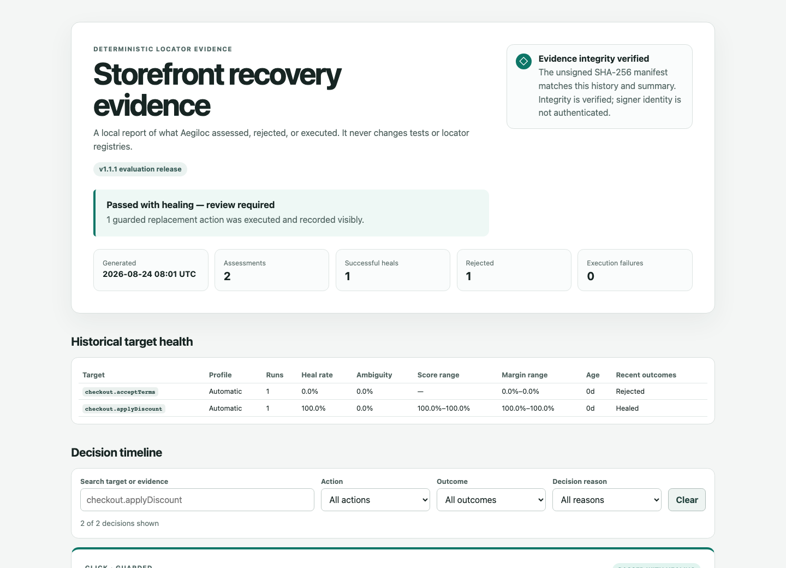
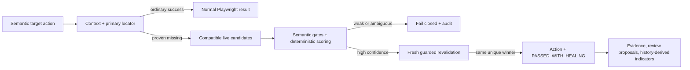

# Aegiloc

[](https://github.com/kamenAsenov/aegiloc/actions/workflows/ci.yml)
[](CHANGELOG.md)
[](LICENSE)

**A conservative, deterministic self-healing layer for Playwright Test.**

Aegiloc (aegis + locator) recovers only proven locator drift. It keeps Playwright's normal action
path intact, rejects ambiguity, protects high-risk actions, and turns every exceptional pass into
reviewable evidence. A false-positive heal is worse than a failed heal.

```ts
await healer.target('checkout.placeOrder').click();
```

**v1.1.1 is a stable-API evaluation release for external review and carefully scoped pilots.** It
is not a claim of production adoption. No Aegiloc package has been published to npm; evaluate the
project from this source repository.

**Project lineage:** Healwright v1.0.1 was the initial GitHub evaluation release. Aegiloc is its
renamed successor with a new repository, package, binary, environment-prefix, and evidence-path
identity. It is not a drop-in package or CLI rename. No package was published under the former name,
so there is no npm registry migration; source-checkout evaluators should follow the
[v1.1 migration guide](docs/MIGRATION-v1.1.md).

## See it work

Requirements: Node.js 22 or 24, pnpm 11, and Playwright Chromium.

```bash
git clone https://github.com/kamenAsenov/aegiloc.git
cd aegiloc
pnpm install --frozen-lockfile
pnpm exec playwright install chromium
pnpm demo
```

The deterministic demo shows an ordinary pass, a safe heal, and an ambiguous rejection, then opens
nothing by default and prints the local evidence-report path. Existing output is protected: review
it before explicitly rerunning with `pnpm cli demo --force`. Use
`pnpm cli demo --force --open` only when you deliberately want to open the report. The complete flow
is checked in under [`examples/realistic-demo`](examples/realistic-demo).



| Demo case       | Decision                                                         | Result                |
| --------------- | ---------------------------------------------------------------- | --------------------- |
| Normal          | The registered locator succeeds; Aegiloc stays out of the way.   | Ordinary pass         |
| Safe drift      | One candidate clears semantics, confidence, margin, and recheck. | `PASSED_WITH_HEALING` |
| Ambiguous drift | Two candidates remain plausible; neither may execute.            | Rejected safely       |

## Safety is the product

- **Primary first:** the registered locator gets normal Playwright waiting and actionability.
- **Missing means missing:** healing begins only after timeout, no observed attachment, and a final
  count of zero.
- **Context before candidates:** an optional exact pathname, unique frame, and unique container
  must match before discovery begins.
- **Semantics before scores:** action, role, accessible identity, and tag compatibility are hard
  gates, not weights that another signal can outweigh.
- **Confidence plus separation:** the winner must clear a threshold and a safe runner-up margin.
- **Two-pass agreement:** guarded execution recollects the page and requires the same unique winner.
- **Human-controlled maintenance:** locator and fingerprint changes are review-only JSON Patch
  previews. Aegiloc never rewrites tests or registries.

Assertions, expected values, business logic, authentication, test data, APIs, network failures, and
real product regressions remain ordinary failures. Read the [safety model](docs/SAFETY-MODEL.md) and
[non-use cases](docs/WHEN-NOT-TO-USE.md) before enabling guarded execution.

## v1.1 capability map

| Area             | Supported contract                                                                      |
| ---------------- | --------------------------------------------------------------------------------------- |
| Actions          | `click`, `fill`, `check`, `uncheck`, `selectOption`, `hover`, `focus`                   |
| Primary locators | role, label, test-id, text, placeholder, title, alt text, CSS                           |
| Target scope     | exact pathname, unique frame, unique container                                          |
| Signals          | role/name, stable attributes, text, tag, ancestor/neighbor context, low-weight geometry |
| Runtime modes    | `off`, `observe`, `guarded`, `strict-ci`                                                |
| Execution risk   | `automatic` or `proposal-only` per target                                               |
| Evidence         | JSONL, ranked candidates, before/after screenshots, summaries, integrity manifests      |
| Review loop      | unique locator suggestions, consensus proposals, opt-in fingerprint observations        |
| Operations       | history-derived indicators, budgets, baselines, waivers, static local report            |

No LLM, API key, cloud service, Docker, database, OCR, or visual AI is required. Candidate scoring is
fixed and replayable. Aegiloc uses public Playwright APIs only.

Action support is not blanket authorization to heal. Treat new `uncheck` targets as `proposal-only`,
especially for consent, terms, permissions, subscriptions, and destructive controls. Start `hover`
in `observe` or `proposal-only`; permit automatic execution only for a reviewed low-impact target.
These are policy recommendations—older registries retain their documented compatibility defaults.

## Minimal integration

Keep targets in reviewed JSON, then use the typed fixture or construct a healer directly:

```ts
import { expect } from '@playwright/test';
import { createAegilocTest, loadTargetRegistry } from 'aegiloc';

const registry = await loadTargetRegistry('aegiloc.targets.json');
const test = createAegilocTest({
  registry,
  mode: 'guarded',
  runId: (testInfo) => process.env.GITHUB_RUN_ID ?? testInfo.testId,
});

test('applies a discount', async ({ healer, page }) => {
  await healer.target('checkout.applyDiscount').click();
  await expect(page.getByRole('status')).toHaveText('Discount applied');
});
```

The assertion remains ordinary Playwright code. See the runnable
[`examples/basic-playwright`](examples/basic-playwright), the full
[adoption guide](docs/ADOPTION.md), and the [technical reference](docs/TECHNICAL-REFERENCE.md).

## How a decision flows



The design draws practical lessons from mature and experimental locator-recovery projects while
keeping a deliberately smaller trust boundary. The
[comparative research](docs/COMPARATIVE-RESEARCH.md) records those influences and the capabilities
Aegiloc intentionally does not copy.

## CLI and local evidence

```bash
pnpm build
pnpm cli doctor
pnpm cli init --registry aegiloc.targets.json
pnpm cli validate --registry aegiloc.targets.json
pnpm proposal:generate
pnpm fingerprint:propose
pnpm governance:evaluate
```

The CLI does not upload evidence, apply proposals, edit test source, publish packages, or open a
browser unless an explicit command and flag request it. See the [CLI reference](docs/CLI.md),
[report viewer](docs/REPORT-VIEWER.md), and [evidence integrity guide](docs/EVIDENCE-INTEGRITY.md).

## Compatibility and verification

- Node.js `>=22 <25`; CI covers Node 22 and 24.
- Playwright Test `>=1.50.0 <2`; release qualification is locked to 1.62.1.
- Strict ESM, TypeScript declarations, source maps, versioned JSON Schemas.
- Full suite on Chromium; focused safety qualification on Firefox and WebKit.
- Public API inventory: [`api/public-api.json`](api/public-api.json).

```bash
pnpm release:check
```

The release gate covers formatting, docs, lint, strict types, public API and package contracts,
reproducibility, SBOM, unit/browser/adversarial suites, reporter concurrency, evidence, governance,
examples, and the focused browser matrix. It never publishes to npm.

## Documentation

- [Quick start](docs/QUICKSTART.md) · [Adoption](docs/ADOPTION.md) · [Troubleshooting](docs/TROUBLESHOOTING.md)
- [Architecture](docs/ARCHITECTURE.md) · [Technical reference](docs/TECHNICAL-REFERENCE.md)
- [Safety model](docs/SAFETY-MODEL.md) · [Known risks](docs/KNOWN-RISKS.md)
- [Compatibility](docs/COMPATIBILITY.md) · [v1.1 migration](docs/MIGRATION-v1.1.md)
- [v1.1.1 release notes](docs/releases/v1.1.1.md) · [Roadmap](ROADMAP.md)

## License

Released under the [MIT License](LICENSE).
