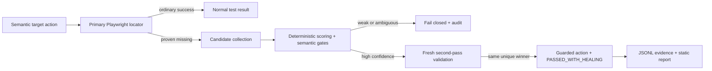

# Healwright

[](https://github.com/kamenAsenov/healwright/actions/workflows/ci.yml)
[](LICENSE)

**A conservative, deterministic self-healing layer for Playwright Test.**

Current milestone: **v0.6.0 Technical Preview · experimental · pre-1.0 · Chromium-first**

Healwright recovers from genuine UI locator drift through an explicit wrapper, inspectable scoring,
and guarded execution. It is a developer tool, not magic AI: the same reviewed fingerprint and live
candidates always produce the same ranking.

```ts
await healer.target('checkout.placeOrder').click();
```

> [!IMPORTANT]
> A false-positive heal is worse than a failed heal. Weak, ambiguous, contradictory, protected, or
> stale evidence fails closed.

The package is not published to npm, and no `v0.6.0` tag or GitHub Release is implied by this
technical-preview branch. Use a local checkout for evaluation.

## Why it exists

A selector can change while the user-facing control stays the same. Ordinary tests fail safely;
naive healing can do something worse by interacting with a plausible but incorrect element and
hiding a product regression.

Healwright takes a narrower path: prove that the primary locator is genuinely missing, collect only
action-compatible replacements, rank them deterministically, and execute only after every safety
gate agrees.

## Safety model in plain English

- **Primary first:** Playwright runs the registered locator normally before recovery is considered.
- **Missing means missing:** healing begins only after a timeout, no observed attachment, and a final
  locator count of zero.
- **Semantics before scores:** role, accessible identity, tag, and action contradictions cannot be
  outweighed by a number.
- **Confidence plus separation:** the best candidate must clear both a threshold and a safe margin
  over the runner-up.
- **Two-pass agreement:** guarded execution recollects the page and requires the same unique winner.
- **Human-controlled change:** Healwright produces evidence and review-only proposals; it never
  rewrites tests or registries.

Assertions, business logic, authentication, test data, APIs, network failures, and real regressions
remain ordinary test failures. Read the full [safety model](docs/SAFETY-MODEL.md) and
[when not to use Healwright](docs/WHEN-NOT-TO-USE.md).

## Quick start

Requirements: Node.js 20+, pnpm 11, and Chromium.

```bash
git clone https://github.com/kamenAsenov/healwright.git
cd healwright
pnpm install --frozen-lockfile
pnpm exec playwright install chromium
pnpm build
node dist/cli.js doctor
pnpm example:realistic
```

The last command runs a normal checkout flow, a safe healed locator drift, an intentionally
ambiguous rejected drift, and then generates a local static evidence report.

## CLI usage

From this unpublished checkout, run `node dist/cli.js`. A future installed package exposes the same
commands as `healwright` through its package `bin` entry.

```bash
node dist/cli.js --help
node dist/cli.js init --registry healwright.targets.json
node dist/cli.js validate --registry healwright.targets.json
node dist/cli.js doctor
node dist/cli.js view \
  --history test-results/realistic-demo/evidence/history.jsonl \
  --summary test-results/realistic-demo/evidence/summary.json \
  --out test-results/realistic-demo/viewer --force
```

`init` refuses to overwrite an existing registry unless `--force` is explicit. `view` rejects a
summary that does not exactly match canonical JSONL history. See the [CLI reference](docs/CLI.md).

## Run the realistic demo

```bash
pnpm example:realistic
```

The deterministic local storefront demonstrates three boundaries:

1. ordinary Playwright is still the baseline when nothing drifted;
2. a capitalization-only discount-button locator change heals with one clear semantic winner;
3. two indistinguishable replacement checkboxes are rejected and remain unchecked.

There is no external demo dependency. Read the [demo guide](docs/REALISTIC-DEMO.md) or inspect
[`examples/realistic-demo`](examples/realistic-demo).

## Open the report viewer

After the realistic demo:

```bash
open test-results/realistic-demo/viewer/index.html
```

On Linux, use `xdg-open`; on Windows, use `start`. The output is a single self-contained static HTML
file with run metrics, assessment reasoning, ranked candidates, successful heals, rejected or
protected decisions, and sanitized evidence references. It contains no remote scripts or telemetry.

See the [report viewer reference](docs/REPORT-VIEWER.md).

## What it supports today

- explicit `click`, `fill`, `check`, and `selectOption` target actions;
- role, label, test-id, text, and CSS primary locators;
- version-controlled JSON targets, fingerprints, policies, and JSON Schemas;
- `off`, `observe`, `guarded`, and `strict-ci` modes;
- accessible role/name, stable attributes, text, tag, ancestor, neighbor, and low-weight geometry
  scoring;
- per-target `automatic` and `proposal-only` execution risk;
- JSONL evidence, summaries, screenshots, visible `PASSED_WITH_HEALING`, review-only proposals, and
  governance budgets;
- a zero-dependency onboarding CLI and static evidence viewer.

## What it intentionally does not support yet

- healing assertions, expected values, authentication, business logic, APIs, network failures, or
  test-data problems;
- silent locator or source rewriting;
- mandatory LLMs, API keys, cloud services, databases, OCR, or visual AI;
- qualified Firefox or WebKit behavior;
- authenticated evidence origin, long-term artifact storage, or a stable v1 API;
- an npm installation path—the package remains unpublished during this preview.

See [known risks](docs/KNOWN-RISKS.md) and the detailed
[technical limitations](docs/TECHNICAL-REFERENCE.md#limitations).

## Architecture



The implementation uses public Playwright APIs only. The deeper component and evidence flow is in
the [architecture document](docs/ARCHITECTURE.md).

## Quality and evaluation

```bash
pnpm release:check
```

The release gate runs formatting, documentation validation, strict lint/type checking, builds,
package contracts and dry-run packing, parallel reporter tests, the full unit/browser/adversarial
suite, evidence verification, governance, the basic consumer example, and the realistic demo. It
does not publish, tag, push, or create a GitHub Release.

## Roadmap

The next priorities are authenticated evidence manifests, supply-chain attestations, cross-browser
qualification, performance budgets, and public API stabilization—not broader automatic healing.
See the [roadmap](ROADMAP.md).

## Documentation

- [Quick start](docs/QUICKSTART.md)
- [CLI reference](docs/CLI.md)
- [Report viewer](docs/REPORT-VIEWER.md)
- [Realistic demo](docs/REALISTIC-DEMO.md)
- [Basic consumer example](examples/basic-playwright)
- [Architecture](docs/ARCHITECTURE.md)
- [Safety model](docs/SAFETY-MODEL.md)
- [Known risks](docs/KNOWN-RISKS.md)
- [When not to use Healwright](docs/WHEN-NOT-TO-USE.md)
- [Technical reference](docs/TECHNICAL-REFERENCE.md)
- [Governance policy](docs/POLICY.md)
- [Product positioning](docs/PRODUCT-POSITIONING.md)
- [v0.6.0 technical-preview notes](docs/releases/v0.6.0.md)
- [Release process](docs/RELEASE-PROCESS.md)
- [Contributing](CONTRIBUTING.md) and [security reporting](SECURITY.md)

## Portfolio note

Healwright is a technical portfolio project demonstrating strict TypeScript framework design,
public Playwright integration, deterministic scoring, adversarial safety testing, audit artifacts,
package contracts, CLI design, static report generation, and CI governance. It is ready to evaluate
and show as a technical preview, not presented as production-proven software.

## License

Released under the [MIT License](LICENSE).
