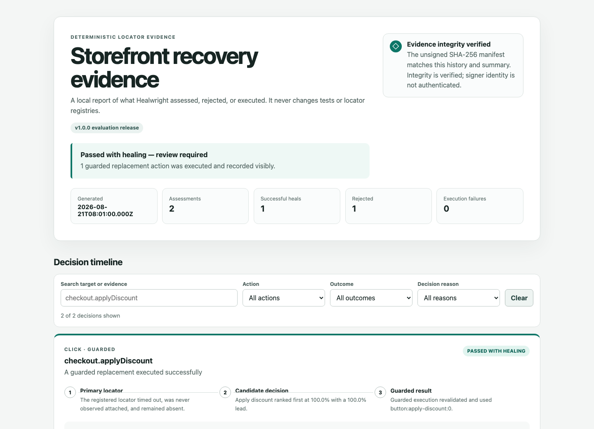
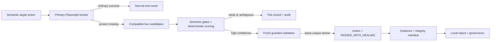

# Healwright

[](https://github.com/kamenAsenov/healwright/actions/workflows/ci.yml)
[](LICENSE)

**A conservative, deterministic self-healing layer for Playwright Test.**

Healwright recovers only proven locator drift through an explicit wrapper, semantic gates, fixed
scoring, and guarded execution. A false-positive heal is worse than a failed heal, so weak,
ambiguous, contradictory, protected, or stale evidence fails closed.

```ts
await healer.target('checkout.placeOrder').click();
```

**v1.0.0 is a stable-API evaluation release for external review and carefully scoped pilots.** It is
not a claim of production adoption, and the package is not published to npm.

## Try the interactive local demo

Requirements: Node.js 22 or 24, pnpm 11, and Playwright Chromium.

```bash
git clone https://github.com/kamenAsenov/healwright.git
cd healwright
pnpm install --frozen-lockfile
pnpm exec playwright install chromium
pnpm demo
```

The command runs the [deterministic local storefront](examples/realistic-demo), verifies its evidence
manifest, and prints the absolute path to the report. Existing demo output is never replaced without
`--force`: review it, then use `pnpm cli demo --force` to rerun. Add `--open` only when you explicitly
want Healwright to open the report: `pnpm cli demo --force --open`.



| Demo case       | What happens                                                       | Result                |
| --------------- | ------------------------------------------------------------------ | --------------------- |
| Normal          | The ordinary Playwright locator succeeds; Healwright does nothing. | Ordinary pass         |
| Safely healed   | One replacement clears confidence, margin, and recheck.            | `PASSED_WITH_HEALING` |
| Ambiguous drift | Two candidates tie, so neither replacement may execute.            | Rejected safely       |

Start with [when to use it](docs/ADOPTION.md#when-to-use-healwright) and
[when not to use it](docs/WHEN-NOT-TO-USE.md).

## The safety contract

- **Primary first:** Playwright runs the registered locator normally before recovery is considered.
- **Missing means missing:** healing starts only after timeout, no observed attachment, and a final
  count of zero.
- **Semantics before scores:** incompatible role, accessible identity, tag, or action cannot be
  outweighed by a number.
- **Confidence plus separation:** the winner must clear both a threshold and a safe runner-up margin.
- **Two-pass agreement:** guarded execution recollects the page and requires the same unique winner.
- **Human-controlled change:** evidence and proposals are review-only; tests and registries are never
  silently rewritten.

Assertions, expected values, business logic, authentication, test data, APIs, network failures, and
real product regressions remain ordinary failures. Read the [full safety model](docs/SAFETY-MODEL.md).

## What v1 supports

- `click`, `fill`, `check`, and `selectOption` through `healer.target(key)`;
- role, label, test-id, text, and CSS primary locators;
- version-controlled JSON targets, fingerprints, policies, and JSON Schemas;
- `off`, `observe`, `guarded`, and `strict-ci` modes;
- accessible role/name, stable attributes, visible text, tag, ancestor/neighbor context, and
  low-weight geometry scoring;
- per-target `automatic` and `proposal-only` execution risk;
- JSONL evidence, screenshots, summaries, visible healed results, review-only proposals, and
  governance budgets;
- integrity manifests plus optional HMAC authentication with external keys;
- a self-contained local report with search, filters, decision timelines, candidate scoring, trust
  status, and next-action guidance;
- deterministic SBOM and package checks, immutable CI actions, and provenance/SBOM attestations.

The full suite is Chromium-first. A focused core safety matrix qualifies Firefox and WebKit against
the locked Playwright version; this is not a broad cross-browser claim.

## Adopt it carefully

The [adoption guide](docs/ADOPTION.md) covers minimal integration, fixtures and Page Objects,
execution-risk choices, healed-pass review, proposals, CI artifacts, retention, and sensitive
evidence. The consumer-shaped project in
[`examples/basic-playwright`](examples/basic-playwright) imports only public package APIs and runs in
CI. The [troubleshooting decision tree](docs/TROUBLESHOOTING.md) starts from the observed outcome
instead of suggesting unsafe threshold changes.

## CLI

From a checkout, build once and run `node dist/cli.js`; an installed package would expose the same
entry point as `healwright`.

```bash
pnpm build
node dist/cli.js doctor
node dist/cli.js init --registry healwright.targets.json
node dist/cli.js validate --registry healwright.targets.json
node dist/cli.js demo
node dist/cli.js view \
  --history test-results/realistic-demo/evidence/history.jsonl \
  --summary test-results/realistic-demo/evidence/summary.json \
  --manifest test-results/realistic-demo/evidence/manifest.json \
  --out test-results/realistic-demo/viewer --force
```

See the [CLI reference](docs/CLI.md), [report guide](docs/REPORT-VIEWER.md), and
[evidence trust guide](docs/EVIDENCE-INTEGRITY.md).

## Architecture



The implementation uses public Playwright APIs only. See the
[architecture document](docs/ARCHITECTURE.md) and [technical reference](docs/TECHNICAL-REFERENCE.md).

## Stable v1 contract

The public package exports, reporter subpath, schema subpaths, Node/Playwright ranges, and versioned
compatibility rules are documented in the [compatibility policy](docs/COMPATIBILITY.md). The
machine-readable inventory is checked in at [`api/public-api.json`](api/public-api.json) and verified
by CI to catch unreviewed surface changes.

- Node.js: `>=22 <25` (CI contract on 22 and 24)
- `@playwright/test`: `>=1.50.0 <2` (release qualification locked to 1.62.1)
- package format: strict ESM with TypeScript declarations and source maps

## Verify the repository

```bash
pnpm release:check
```

The gate runs formatting, documentation, strict lint/type checks, API and package contracts,
reproducibility, deterministic SBOM checks, unit/browser/adversarial suites, reporter concurrency,
evidence, governance, consumer examples, the realistic demo, and focused Firefox/WebKit
qualification. It does not publish to npm.

## Documentation

- [Quick start](docs/QUICKSTART.md)
- [Adoption guide](docs/ADOPTION.md)
- [Troubleshooting decision tree](docs/TROUBLESHOOTING.md)
- [CLI](docs/CLI.md) and [report viewer](docs/REPORT-VIEWER.md)
- [Evidence integrity](docs/EVIDENCE-INTEGRITY.md) and [supply chain](docs/SUPPLY-CHAIN.md)
- [Cross-browser qualification](docs/CROSS-BROWSER-QUALIFICATION.md)
- [Known risks](docs/KNOWN-RISKS.md) and [non-use cases](docs/WHEN-NOT-TO-USE.md)
- [Compatibility policy](docs/COMPATIBILITY.md) and [v1.0.0 notes](docs/releases/v1.0.0.md)
- [Contributing](CONTRIBUTING.md) and [security reporting](SECURITY.md)

## License

Released under the [MIT License](LICENSE).
