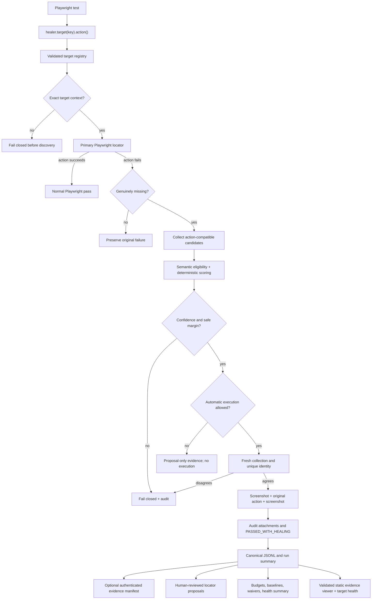

# Architecture

Aegiloc is a deterministic layer around Playwright Test actions. Tests name a semantic target;
the version-controlled registry supplies its primary locator, fingerprint, allowed actions, and
risk policy. Ordinary Playwright behavior remains the default path.

## End-to-end flow



## Components

### Target registry

[`src/registry.ts`](../src/registry.ts) strictly parses the JSON registry before test interaction.
Unknown fields, invalid locator shapes, unsupported roles/actions, duplicate actions, malformed
fingerprints, and unsafe thresholds fail early. [`registry/targets.schema.json`](../registry/targets.schema.json)
provides editor and tooling support; parity tests keep it aligned with runtime validation.

### Wrapper and primary action

[`src/healer.ts`](../src/healer.ts) implements the explicit target API and action allowlists.
[`src/locator.ts`](../src/locator.ts) resolves role, label, test-id, text, placeholder, title,
alt-text, and CSS primary locators using public Playwright APIs. [`src/context.ts`](../src/context.ts)
requires any exact pathname, unique frame, and unique container before primary or recovery logic.
[`src/classification.ts`](../src/classification.ts) runs the primary action and proves genuine
absence without reclassifying ordinary actionability failures.

### Candidate collection

[`src/candidates.ts`](../src/candidates.ts) queries common interactive HTML and ARIA patterns through
public locators. It retains bounded, allowlisted signals: accessible role/name, visible text, tag,
stable attributes, ancestor and sibling context, normalized geometry, and action compatibility.
Sensitive form values are not candidate signals. One public `Locator.evaluateAll()` call snapshots
DOM evidence, followed by bounded concurrent public `Locator.ariaSnapshot()` calls; result ordering
remains the original DOM order.

### Eligibility and scoring

[`src/scoring.ts`](../src/scoring.ts) separates mandatory semantic eligibility from weighted ranking.
The pure scoring engine uses fixed weights and stable tie-breaking; input order cannot alter the
result. Confidence and runner-up margin are independent gates.

### Guarded execution

The wrapper recollects and reranks immediately before executing. The winner must remain the same and
resolve through one exact accessible role/name/tag identity. An available test ID further narrows the
locator. Registry risk is checked again before resolution so a policy change cannot race execution.

### Audit and artifacts

[`src/audit.ts`](../src/audit.ts) defines versioned assessment and execution events plus JSONL and
Playwright attachment sinks. [`src/artifacts.ts`](../src/artifacts.ts) captures before/after images
with sensitive controls masked. [`src/result.ts`](../src/result.ts) attaches structured results and
the visible `PASSED_WITH_HEALING` marker.

### Reporter and canonical evidence

[`src/reporter.ts`](../src/reporter.ts) aggregates typed attachments in Playwright's coordinator
process instead of letting workers append to one shared file. [`src/evidence.ts`](../src/evidence.ts)
deduplicates identical events, rejects conflicts, orders records deterministically, and atomically
writes canonical history and a machine-readable summary.

[`src/evidence-manifest.ts`](../src/evidence-manifest.ts) binds those sibling files to ordered byte
lengths and SHA-256 digests. Optional HMAC-SHA-256 authentication covers the canonical unsigned
manifest. Verification checks authentication before evidence and fails closed on missing,
truncated, reordered, replaced, or mismatched files.

### Review-only proposals

[`src/proposals.ts`](../src/proposals.ts) links eligible assessments to successful executions and
requires independent-run consensus. [`src/proposal-validation.ts`](../src/proposal-validation.ts)
strictly verifies proposal shape, hashes, current registry state, provenance, and screenshot
references. [`src/suggestions.ts`](../src/suggestions.ts) derives ordered Playwright-native locator
alternatives and proves that each suggestion is unique and resolves to the assessed live candidate.

[`src/fingerprints.ts`](../src/fingerprints.ts) separately records opt-in fingerprints only after an
ordinary primary action succeeds. Independent-run consensus can create a review-required
fingerprint JSON Patch preview. Locator and fingerprint proposals are artifacts for humans; no code
applies them automatically.

### Typed Playwright fixture

[`src/fixture.ts`](../src/fixture.ts) exposes `createAegilocTest`. It wires the explicit healer to
Playwright attachments, screenshots, result annotations, and provenance without changing the
runtime trust boundary. Direct `createHealer` construction remains public.

### Governance

[`src/governance.ts`](../src/governance.ts) consumes canonical evidence after the run. It evaluates
budgets, baselines, retries, protected attempts, unknown targets, and temporary exact-scope waivers.
Governance cannot influence candidate selection or runtime execution.

### CLI and static viewer

[`src/cli-core.ts`](../src/cli-core.ts) parses the onboarding commands and keeps filesystem mutation
explicit. [`src/cli.ts`](../src/cli.ts) is the compiled package bin entry. `init` uses exclusive file
creation, `validate` reuses the runtime registry parser, and `doctor` performs local checks without
installing software.

[`src/report-viewer.ts`](../src/report-viewer.ts) strictly parses history, recomputes the canonical
summary, and emits one escaped, script-free HTML file. The viewer is downstream evidence
presentation: it cannot influence scoring, runtime execution, proposals, or governance.

## Trust boundaries

```text
Reviewed source and registry
        │
        ▼
Playwright runtime ──► audit attachments ──► canonical local evidence ──► manifest
        │                                         │                         │
        ▼                                         ├──► proposal review       └──► trusted review
Application under test                            └──► governance gate
```

The live page is untrusted candidate input. Audit history is validated input, not an authorization
source. Governance and proposals consume evidence but never make an unsafe candidate executable.

## Public API and package boundaries

`src/index.ts` is the intentional framework surface. `aegiloc/reporter` is the reporter subpath;
the `aegiloc` package bin points to `dist/cli.js`; seven schema subpaths expose registry, locator
proposal, fingerprint proposal, evidence summary/manifest, policy, and health contracts. Package
tests compile an external-style consumer and load built exports through Node package resolution.

See [`TECHNICAL-REFERENCE.md`](TECHNICAL-REFERENCE.md) for modes, scoring weights, evidence files,
fixture mutations, and package details.
